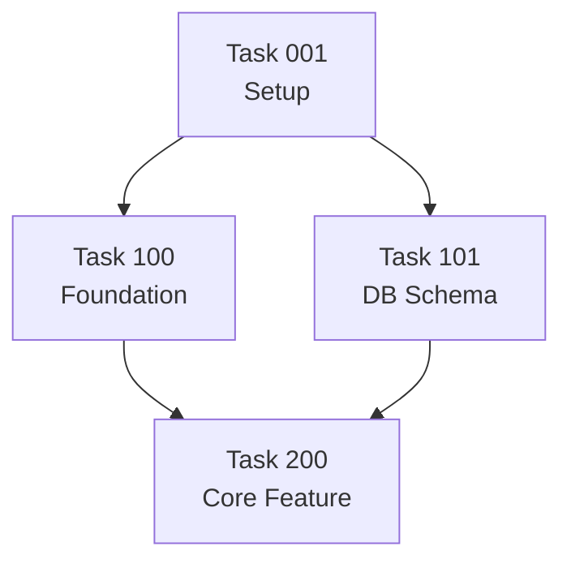

# DEPENDENCY_GRAPH.md
<!-- AUTO-GENERATED by @trent-cleanup — DO NOT EDIT MANUALLY -->
<!-- Regenerated nightly. Modify dependencies in individual task files. -->

**Generated**: {YYYY-MM-DD HH:MM UTC}
**Project**: {project_name}

---

## Critical Path

Longest dependency chain to project completion:

```
{task_id} → {task_id} → {task_id} → ... → DONE
Estimated critical path length: {N} tasks
```

---

## Dependency Graph



---

## Top Blockers

Tasks that, if completed, would unblock the most other tasks:

| Rank | Task | Title | Unblocks | Status |
|------|------|-------|---------|--------|
| 1 | {id} | {title} | {n} tasks | {status} |
| 2 | {id} | {title} | {n} tasks | {status} |
| 3 | {id} | {title} | {n} tasks | {status} |

---

## Currently Blocked Tasks

Tasks waiting on incomplete dependencies:

| Task | Title | Waiting On | Status of Blocker |
|------|-------|-----------|-------------------|
| {id} | {title} | Task {id} | [🔄] in-progress |

---

## Orphan Tasks

Tasks with no dependencies and nothing depending on them (can be done anytime):

| Task | Title | Subsystem | Priority |
|------|-------|-----------|---------|
| {id} | {title} | {subsystem} | {priority} |

---

*Regenerate with: `@trent-cleanup` or `@trent-status`*
